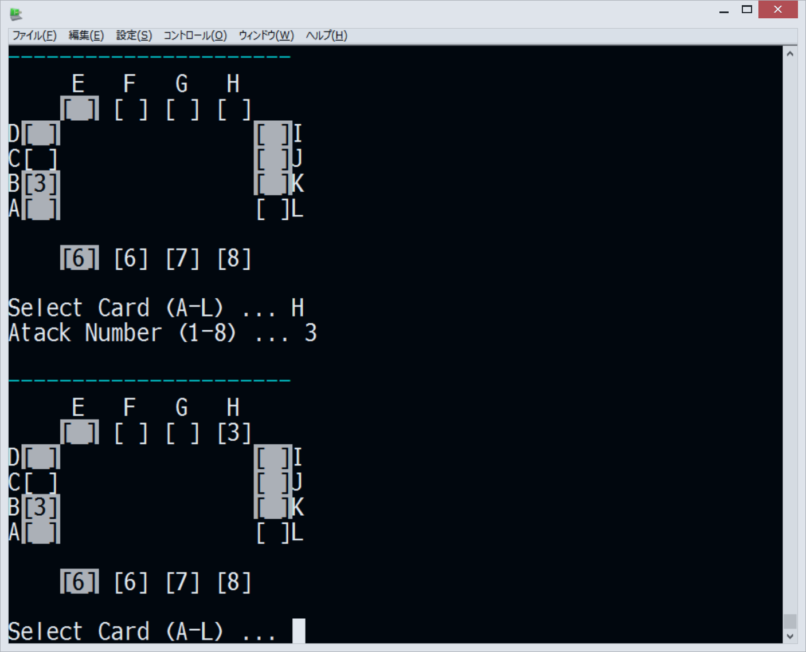

erlgogame
=========

Erlangの練習に[アルゴゲーム](http://www.sansu-olympic.gr.jp/algo/)を実装してみた。

今のところ一人で詰めアルゴができるだけ。src/で以下のように入力してスタートする。

    $ erlc game.erl
    $ erl -noshell -eval 'game:start().'

終了はCtrl-cで。

TODO
----

 * 乱数の初期化
 * ゲームの進行を管理するサーバ
 * 分散化
 * 対戦対応
 * 対戦相手になるボット
 * Webクライアントとか
